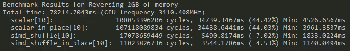
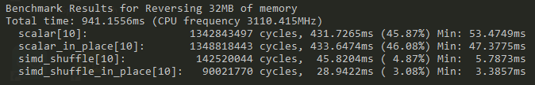

# Testing & Benchmarking different methods of reversing Buffers

The Idea behind this project was too test and benchmark different methods of reversing a memory buffer or a file (support for files hasn't been added yet).

All code is contained within the `main.c` file. `ail.h` and `ail_bench.h` only contain some utility functions for benchmarking (and are taken directly from my C library [ail](https://github.com/ArtInLines/ail)).

There are a few ways to easily customize the program. All of these are done via macros, that are defined at the top of the file.

- `#define TEST` enables code to test all routines for correctness
- `#define BENCH` enables code to benchmark all routines
- `#define ALL` enables both testing and benchmarking
- `#define BUFFER_SIZE n` sets the amount of memory to reverse to `n`
- `#define ITER_COUNT n` sets the amount of iterations done when benchmarking to `n`

When benchmarking, each routine is printed with the amount of times it was called.
Next to its name is the amount of time spent in the function in total (both in approx. clock cycles and milliseconds).
The percentage shows how much relative time of the program was spent in this function.
The `Min:` section shows how long the shortest run of the function took.

## Routines

There are currently 4 routines implemented.
1. `scalar`: A simple scalar loop, writing the result into a second buffer and going byte-by-byte through the buffer
2. `scalar_in_place`: A simple scalar loop, reversing the buffer in place and going byte-by-byte through the buffer
3. `simd_shuffle`: A simple SIMD loop, using the SSSE3 shuffling instruction for reversing bytes and writing the result into a second buffer
4. `simd_shuffle_in_place`: A simple SIMD loop, using the same shuffling instruction, but reversing the buffer in place

## Requirements

A CPU with SSE2 and SSSE3 extensions is required for the SIMD routines to work.

For allocating memory, VirtualAlloc/mmap is currently used. An OS that doesn't support either of these thus requires minor changes.

The code has only been tested on Windows, but should work on Linux as well.

## Results

I encourage you to run this on your own machine, to reproduce these results.

For a 2GB buffer, I got the following results, showing almost 10x speed-up by using SIMD:

For a 32MB buffer, I got the following results, showing up to 14x speed-up by using SIMD:

